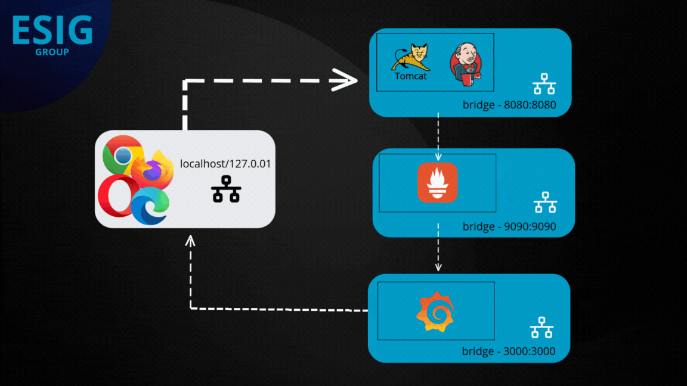

## Descrição
Este projeto implementa um ambiente de integração contínua (CI) e entrega contínua (CD) utilizando o Jenkins rodando em um servidor Tomcat, monitorado pelo Prometheus e visualizado no Grafana. A infraestrutura é configurada e orquestrada com Docker e Docker Compose, permitindo fácil implantação e escalabilidade.



## Arquitetura e funcionalidades

#### A solução é composta pelos seguintes serviços principais:

Jenkins (Tomcat): Gerencia pipelines de CI/CD e automação de builds.
Prometheus: Coleta e armazena métricas de desempenho do Jenkins.
Grafana: Visualiza e analisa as métricas coletadas pelo Prometheus.
O diagrama abaixo ilustra a arquitetura do sistema:


## Pré-requisitos

Antes de começar, certifique-se de ter os seguintes requisitos:

- [Docker](https://docs.docker.com/get-docker/) instalado e funcionando corretamente na sua máquina.
- [Docker Compose](https://docs.docker.com/compose/install/) instalado para orquestração de múltiplos contêineres.

## Construindo a Imagem

Para construir a imagem Docker que contém o Jenkins rodando no Tomcat, siga os passos abaixo:

1. Navegue até o diretório onde o arquivo `Dockerfile` está localizado.
2. Execute o seguinte comando para construir a imagem:

    ```bash
    docker build -t jenkins-tomcat .
    ```

## Executando os Contêineres

Para simplificar a execução dos serviços, você pode usar o Docker Compose. O arquivo `docker-compose.yml` já está configurado para executar os serviços do Tomcat (com Jenkins) e do Prometheus. Para iniciar os contêineres, siga as etapas abaixo:

1. **Inicie os contêineres** usando o comando:

    ```bash
    docker-compose up -d
    ```

2. **Acesse o Jenkins** no navegador. O Jenkins estará disponível em:

    ```bash
    http://localhost:8080/jenkins
    ```

Aqui, você verá a interface de configuração inicial do Jenkins.

## Recuperando a Senha de Administrador

Ao acessar o Jenkins pela primeira vez, será solicitada uma **senha de administrador inicial**. Para recuperá-la, siga estas etapas:

1. Acesse o contêiner em execução usando o comando:

    ```bash
    docker exec -it tomcat-jenkins /bin/bash
    ```

2. Uma vez dentro do contêiner, execute o comando abaixo para exibir a senha:

    ```bash
    cat /root/.jenkins/secrets/initialAdminPassword
    ```

3. Copie a senha exibida no terminal e cole-a na tela de configuração inicial do Jenkins.

### Usando o Prometheus para Monitoramento

O Prometheus é uma ferramenta de monitoramento poderosa que permite coletar e armazenar métricas em tempo real. No contexto do Jenkins, o Prometheus pode ser utilizado para monitorar o desempenho do servidor Jenkins, a quantidade de builds realizados, o tempo de execução de jobs e outros dados importantes que ajudam a garantir a saúde e a eficiência do ambiente de CI/CD.

#### Por que usar o Prometheus?

- **Visibilidade**: Monitore a saúde do Jenkins e identifique problemas antes que eles afetem a entrega.
- **Alertas**: Configure alertas baseados em métricas para ser notificado sobre problemas, como builds que falham com frequência ou tempos de execução acima do normal.
- **Análise de Performance**: Analise o desempenho ao longo do tempo e identifique tendências que podem ajudar a otimizar o uso do Jenkins.

#### Acessando a Interface do Prometheus

Após iniciar os contêineres, você pode acessar a interface do Prometheus no navegador. O Prometheus estará disponível em:

```bash
http://localhost:9090
```

Aqui você poderá visualizar as métricas coletadas, executar consultas e configurar alertas conforme necessário.

## Acessando o Grafana

Após iniciar os contêineres, você pode acessar a interface do Grafana no navegador. O Grafana estará disponível em:

```
http://localhost:3000
```

### Login

Use as credenciais padrão:

- **Usuário**: `admin`
- **Senha**: `admin` (será solicitado que você mude a senha após o primeiro login).

#### Para mais detalhes sobre a configuração do plugin do Prometheus no Jenkins e outras funcionalidades, visite a [Wiki](https://github.com/micherenio-nascimento/Teste-ESIG/wiki#conclus%C3%A3o) do projeto.